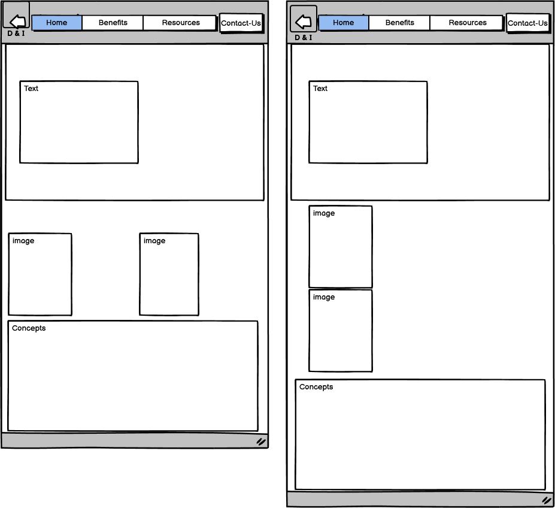
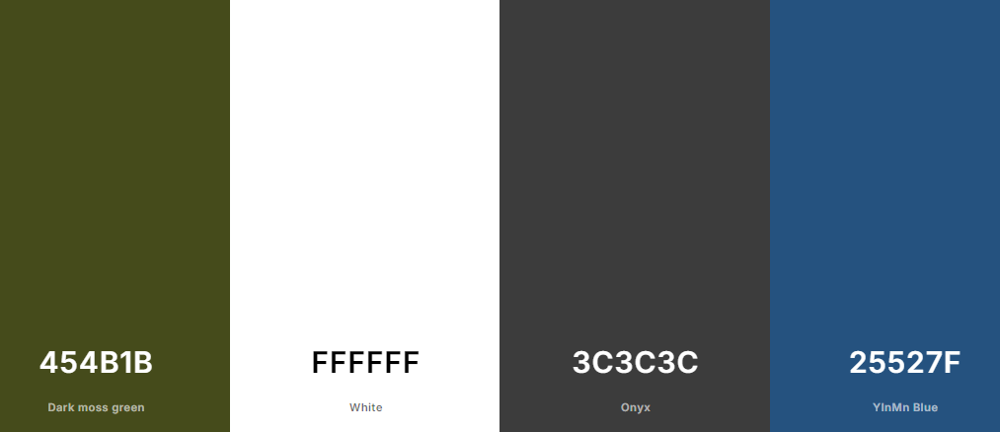
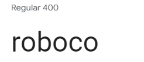
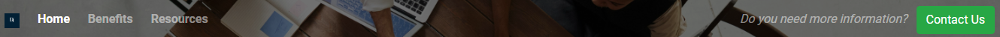
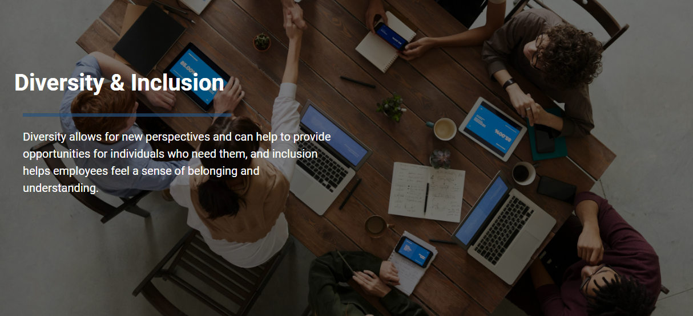
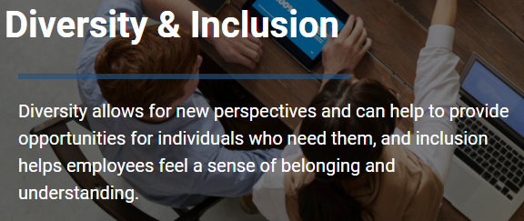
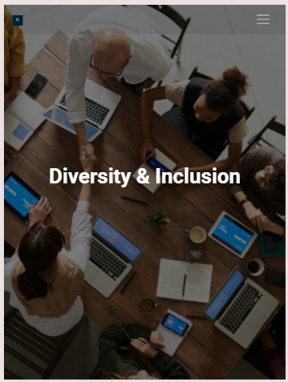
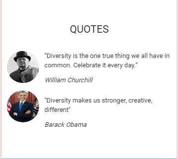
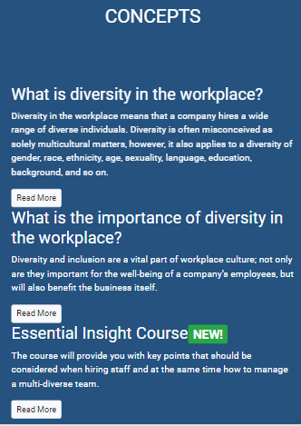
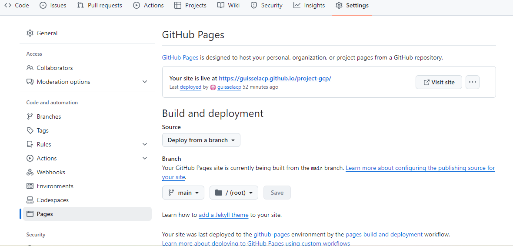

# Be Equity (Diversity & Inclusion)

Welcome! 
[Diversity & Inclusion](https://guisselacp.github.io/project-gcp/)

## CONTENTS

## User Experience (UX)
### User Stories
### Primary Goal
###### Be Equity is a web page that provides information about the importance of diversity and inclusion in the workplace
### Visitors Goals
###### I want to understand the main purpose of the site and learn more about Diversity & Inclusion.
### Returning Visitor Goals
###### I want to find some resources to update my knowledge in the topic.
### Frequent User Goals
###### I want to check if there is new information.
## Creation Process
1. Strategy  
###### * The topic impacts society, so I require a website with concise information.
###### * The design of the page considered neutral colours
2. Scope
###### * The site contain essential information and useful to the user.
3. Structural
###### * The site is easy to navigate.
###### * Acceptable interaction design.
4. Skeleton
###### * The site has three-items navigation bar of 'Home', 'Benefits', and Contact-Us, is situated always to the right of the top.
###### * Each page has a large image but in an opaque style so the text can be seen.
## Wireframes
### Wireframes - Homepage Desktop & Mobile

5. Surface
###### * Images are used to background.
###### * A pallete of colours was selected.
###### * The font selected was roboco-font to provide legible text.
## Design
### Color Scheme
###### The colours chosen are sober because the topic to be shown is essential.

### Typography
[Google Fonts](https://fonts.google.com/) was used to import the fonts 'Roboco Sans-serif'. It is clear for the website.

### Imagery
##### The images that I have chosen for my site were downloaded from the following page: 
[pexel.com](https://www.pexels.com/)
## Page Features
### Navbar

###### There are three pages and a button to Contact-Us.
### Hero Image

###### The hero image shows a group of people in a work environment, which shows diversity.
### Call to Action

###### The image has its opacity set to allow the hero image to still show through.
### Tablet & Mobile View

## Future Features
##### For future development, I would like to include videos on the topic and be able to get feedback from users regarding what additional information they require.
## Technologies Used
### Languages Used
###### * HTML5
###### * CSS3
### Frameworks, Libraries, Technologies & Program Used
###### * GitHub - used to save and store all files for this website
###### * Git - used for version control
###### * Google Fonts - fonts were imported from here
###### * Font Awesome - icons and their associated kit were downloaded from here
###### * Favicon.io - for ice cream favicon
###### * W3C Validator - for validating the HTML and CSS code
## Deployment
### How to deploy
###### GitHub was used to deploy the website. These were the steps taken to achieve this:

###### 1 Login to GitHub account
###### 2 Navigate to the project repository, project-gcp
###### 3 Click the Settings button near the top of the page
###### 4 In the left-hand menu, find and click on the Pages button
###### 5 In the Source section, choose 'main' from the drop-down, select branch menu
###### 6 Select 'root' from the drop-down folder menu
###### 7 Click 'Save' and after a few moments the project will have been made live and a link is visible at the top of the page

## Testing

## Credits
### Content References
###### * [Code Institute](https://codeinstitute.net/) for their HTML/CSS learning material and 'content zoom' module in Bootstrap.

###### * [W3School](https://www.w3schools.com/) for additional learning material.

###### * [Chat GPT](https://chatgpt.com/) code for the "Read More" button.
###### * [Legislation](https://www.gov.uk/government/organisations/government-legal-department/about/equality-and-diversity) for knowledge  of the topic
###### * [Promoting D & I](https://uk.indeed.com/hire/c/info/diversity-and-inclusion) for add information my site.

### Media References
###### * [Pexels](https://www.pexels.com/) for all images used on this site.
###### * [Font Awesome](https://fontawesome.com/) for the icons used in the footer of this site.
###### * [Favicon](https://favicon.io/) for the favicon used for this site.